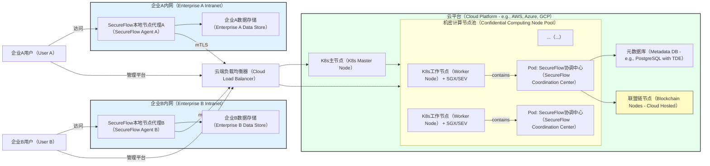
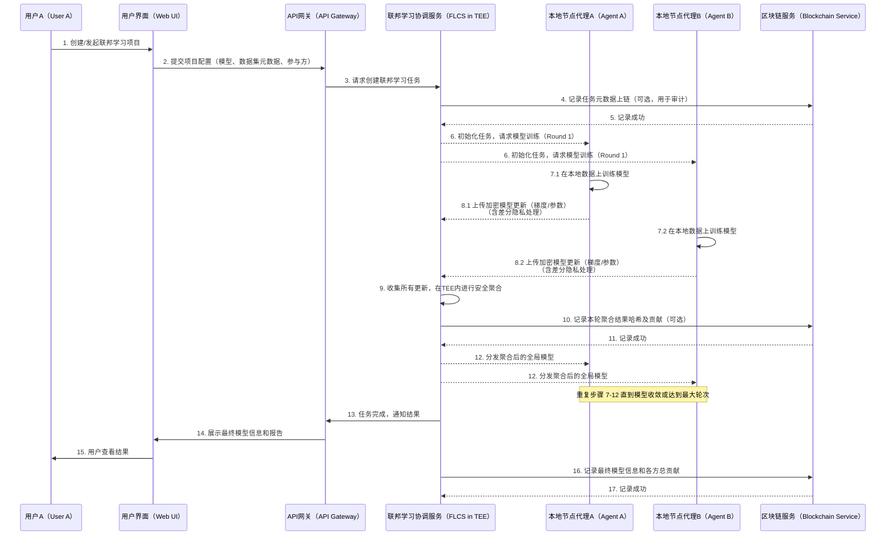

# SecureFlow 架构设计文档

## 1. 引言

本文档详细阐述了 `secureflow` 项目的总体架构设计。`secureflow` 旨在构建一个基于联邦学习、多方安全计算、机密计算与区块链技术的企业级隐私保护与数据协作平台。本文档的目标是为开发团队提供清晰的指导，确保系统设计的健壮性、可扩展性、可维护性和安全性。

## 2. 设计原则

`secureflow` 的架构设计遵循以下核心原则：

* **分层与模块化设计：** 采用清晰的多层架构，模块间高内聚、低耦合，易于独立开发、测试和替换。
* **借鉴与创新：** 充分吸收参考开源项目的优秀设计，并结合实际需求进行优化与创新。
* **端到端价值导向：** 设计直接映射到用户需求和预期价值，关注核心业务流程的实现。
* **可测试性：** 架构设计充分考虑可测试性，确保各模块及系统整体易于测试。
* **可观测性：** 内建统一的日志、指标和追踪机制。
* **可靠性与容错性：** 包含健壮的错误处理和恢复机制。
* **高性能与可伸缩性：** 架构支持水平扩展和性能优化。
* **安全性：** 安全性是设计的核心考量，遵循安全编码规范，并在各个层面集成隐私保护技术。
* **代码质量与可维护性：** 遵循 Clean Code 原则，确保代码清晰、易懂、易维护。

## 3. 系统架构

`secureflow` 采用混合式、多层架构，主要包括本地节点（SecureFlow Agent）和云端协调中心（SecureFlow Server），并通过区块链网络保障操作的可追溯性和透明度。

### 3.1 架构概览图

下图展示了 `secureflow` 系统的高层组件及其交互关系。

```mermaid
graph TD
    %% 模块命名规则示例修订 "大写缩写[中文名称（英文术语）]"
    subgraph USER[用户（User）]
        UI[用户界面（Web UI / Low-Code Platform）]
    end

    subgraph CC[云端协调中心（Cloud Coordination Center） - 运行于TEE环境]
        APIGW[API网关（API Gateway）] --> AS[应用服务（Application Services）]
        AS --> FLCS[联邦学习协调服务（FL Coordination Service）]
        AS --> MPCS[多方安全计算服务（MPC Service）]
        AS --> CCS[机密计算管理（Confidential Computing Mgmt）]
        AS --> DMS[数据与模型管理（Data & Model Mgmt）]
        AS --> JS[作业调度服务（Job Scheduler）]
        AS --> UMS[用户与权限管理（User & Access Mgmt）]
        FLCS <--> AGG[安全聚合器（Secure Aggregator in TEE）]
        MPCS <--> MPCE[MPC引擎（MPC Engine in TEE）]
        JS --> K8S[Kubernetes + 机密容器（Confidential Containers）]
        DMS --> METADB[元数据库（Metadata Database）]
        UMS --> METADB
    end

    subgraph LN[本地节点（Local Node / SecureFlow Agent） - 运行于企业内网]
        LNA[本地节点代理（Local Node Agent）]
        LNA --> LDT[本地数据与任务处理（Local Data & Task Processing）]
        LDT --> RAWDATA[原始数据（Raw Data - 不离开本地）]
        LDT --> LMT[本地模型训练/预处理（Local Model Training/Preprocessing）]
    end

    subgraph BC[区块链网络（Blockchain Network） - 联盟链]
        BIF[区块链接口（Blockchain Interface）] --> SMRT[智能合约（Smart Contracts）]
        SMRT <--> LEDGER[分布式账本（Distributed Ledger - 审计日志/贡献/收益）]
    end

    UI --> APIGW
    LNA -- TLS + mTLS --> APIGW 
    %% 参数/梯度交换
    AS --> BIF
    APIGW --> K8S 
    %% 部署与管理协调中心服务

    %% 交互说明
    %% 1. 用户通过UI发起协作请求
    %% 2. API网关处理请求，转发至应用服务
    %% 3. 应用服务根据请求类型调用相应核心服务（FL, MPC, CC）
    %% 4. 联邦学习中，协调服务与本地节点代理交互，交换加密的模型参数/梯度
    %% 5. 本地节点代理在本地处理数据和执行部分计算任务
    %% 6. MPC服务协调多方进行加密计算
    %% 7. 机密计算管理确保核心计算在TEE中执行
    %% 8. 所有关键操作通过区块链接口记录在账本
    %% 9. 作业调度服务通过K8s管理机密容器中的任务
````

**图注：** `secureflow` 架构概览图展示了用户、本地节点、云端协调中心和区块链网络之间的主要交互。核心的隐私计算和协调逻辑位于云端协调中心的TEE（Trusted Execution Environment，可信执行环境）中。原始数据保留在本地节点。

### 3.2 分层架构

系统采用经典的多层架构，确保职责分离和模块化。

```mermaid
graph TD
    %% Layer Definition
    PL[展现层（Presentation Layer）] --> APL[应用层（Application Layer）]
    APL --> DL[领域层（Domain Layer）]
    DL --> IL[基础设施层（Infrastructure Layer）]

    subgraph PL[展现层（Presentation Layer）]
        direction LR
        WEBUI[Web用户界面（Web UI - Low Code）]
        CLI[命令行工具（CLI）]
        SDK[客户端SDK（Client SDKs - Go/Python/Java）]
        APIGW_PL[API网关接口（API Gateway - REST/gRPC）]
    end

    subgraph APL[应用层（Application Layer）]
        direction LR
        USVC[用户服务（User Service）]
        PSVC[项目协作服务（Project Collaboration Service）]
        JMSVC[作业管理服务（Job Management Service）]
        DSSVC[数据服务（Data Service）]
        MODELSVC[模型服务（Model Service）]
        AUDITSVC[审计服务（Audit Service）]
    end

    subgraph DL[领域层（Domain Layer）]
        direction TB
        CORE_FL[联邦学习核心（Federated Learning Core）]
        CORE_MPC[多方安全计算核心（MPC Core）]
        CORE_CC[机密计算核心（Confidential Computing Core）]
        CORE_BC[区块链与智能合约核心（Blockchain & Smart Contract Core）]
        DM_CORE[领域模型（Domain Models - Project, Dataset, Model, Job, User, Policy）]
        DPP[数据预处理与特征工程（Data Preprocessing & Feature Engineering）]
    end

    subgraph IL[基础设施层（Infrastructure Layer）]
        direction LR
        DB[数据库接口（Database - Metadata, Job Queues）]
        TEE_INFRA[TEE运行时与SDK（TEE Runtime & SDKs - SGX, SEV）]
        FL_FRAMEWORKS[联邦学习框架适配器（FL Framework Adapters - TFF, PySyft, Flower）]
        MPC_LIBS[MPC库适配器（MPC Library Adapters - MP-SPDZ, MPyC）]
        BC_CLIENT[区块链客户端（Blockchain Client - Fabric, Quorum）]
        MSG_QUEUE[消息队列（Message Queue - Optional for async tasks）]
        LOGGER[统一日志（Unified Logging）]
        CONFIG[配置管理（Configuration Management）]
        CRYPTO[密码学工具（Cryptography Utilities）]
    end

    %% Connections
    WEBUI --> APIGW_PL
    CLI --> APIGW_PL
    SDK --> APIGW_PL
    APIGW_PL --> USVC
    APIGW_PL --> PSVC
    APIGW_PL --> JMSVC
    APIGW_PL --> DSSVC
    APIGW_PL --> MODELSVC
    APIGW_PL --> AUDITSVC

    USVC --> DM_CORE
    PSVC --> DM_CORE
    JMSVC --> DM_CORE
    JMSVC --> CORE_FL
    JMSVC --> CORE_MPC
    JMSVC --> CORE_CC
    DSSVC --> DM_CORE
    DSSVC --> DPP
    MODELSVC --> DM_CORE
    MODELSVC --> CORE_FL
    AUDITSVC --> CORE_BC

    CORE_FL --> FL_FRAMEWORKS
    CORE_MPC --> MPC_LIBS
    CORE_CC --> TEE_INFRA
    CORE_BC --> BC_CLIENT
    DM_CORE --> DB
    DPP --> TEE_INFRA 
    %% Secure preprocessing

    %% Cross-cutting concerns
    APL --> LOGGER
    DL --> LOGGER
    IL --> LOGGER
    APL --> CONFIG
    DL --> CONFIG
    IL --> CONFIG
    APL --> CRYPTO
    DL --> CRYPTO
    IL --> CRYPTO

```

**图注：** 系统分层架构。展现层处理用户交互；应用层编排业务用例；领域层包含核心业务逻辑和隐私计算技术集成；基础设施层提供底层技术支持。

### 3.3 部署架构

下图描述了 `secureflow` 各组件的典型部署方案。



**图注：** `secureflow` 部署架构展示了本地节点代理部署在企业内网，与本地数据存储交互。云端协调中心部署在支持机密计算的 Kubernetes 集群中。区块链节点可以根据联盟策略部署在云端或多方环境中。

### 3.4 核心流程示例：联邦学习模型训练



**图注：** 联邦学习模型训练时序图展示了从用户发起任务到多方协作训练，再到结果记录的完整流程。关键步骤如模型更新的上传和聚合都在安全保护下进行。

## 4\. 技术选型（初步）

  * **后端语言：** Golang (1.20.2+)
  * **API：** gRPC (主要内部通信), RESTful (对外接口)
  * **联邦学习参考：** TensorFlow Federated (TFF), PySyft, Flower (通过适配器集成)
  * **MPC参考：** MP-SPDZ, MPyC (通过适配器集成)
  * **机密计算：** Kubernetes + Confidential Containers (Enarx, SCONE, Marblerun as options for runtime) on Intel SGX / AMD SEV
  * **区块链：** Hyperledger Fabric or Quorum
  * **前端：** React + Ant Design (or Element UI)
  * **数据库：** PostgreSQL (for metadata), potentially others for specific needs.
  * **消息队列 (可选):** RabbitMQ or NATS
  * **监控：** Prometheus, Grafana
  * **日志：** Standardized logging library (e.g., wrapper around Logrus or Zap)

## 5\. 项目目录结构

```
secureflow/
├── Makefile
├── go.mod
├── go.sum
├── README.md
├── README-zh.md
├── LICENSE
├── CONTRIBUTING.md
│
├── api/                            # Protobuf definitions, OpenAPI/Swagger specs
│   └── proto/
│       └── v1/
│           ├── common.proto        # Common message types
│           ├── user_service.proto
│           ├── project_service.proto
│           ├── data_service.proto
│           ├── job_service.proto
│           ├── fl_service.proto
│           └── mpc_service.proto
│
├── cmd/                            # Main applications
│   ├── secureflow-server/          # Cloud Coordination Center
│   │   └── main.go
│   └── secureflow-agent/           # Local Node Agent
│       └── main.go
│
├── configs/                        # Configuration files (templates, defaults)
│   ├── server.yaml.example
│   └── agent.yaml.example
│
├── docs/                           # Documentation
│   └── architecture.md             # This file
│
├── internal/                       # Private application and library code
│   ├── apiserver/                  # API server implementation (gRPC & REST gateway)
│   │   ├── server.go
│   │   ├── grpc_server.go
│   │   ├── rest_gateway.go
│   │   ├── middleware/
│   │   │   ├── auth.go
│   │   │   └── logging.go
│   │   └── handler/                # gRPC service implementations
│   │       ├── user_handler.go
│   │       ├── project_handler.go
│   │       ├── data_handler.go
│   │       ├── job_handler.go
│   │       ├── fl_handler.go
│   │       └── mpc_handler.go
│   │
│   ├── app/                        # Application services (business logic orchestration)
│   │   ├── user_app_service.go
│   │   ├── project_app_service.go
│   │   ├── data_app_service.go
│   │   ├── job_app_service.go
│   │   ├── model_app_service.go
│   │   ├── audit_app_service.go
│   │   └── interface.go            # Interfaces for app services
│   │
│   ├── core/                       # Core domain logic and interfaces
│   │   ├── entity/                 # Domain entities/models
│   │   │   ├── user.go
│   │   │   ├── project.go
│   │   │   ├── dataset.go
│   │   │   ├── model.go
│   │   │   ├── job.go
│   │   │   ├── policy.go
│   │   │   └── common_types.go     # Common domain types
│   │   ├── repository/             # Repository interfaces for domain entities
│   │   │   ├── user_repo.go
│   │   │   ├── project_repo.go
│   │   │   ├── dataset_repo.go
│   │   │   ├── model_repo.go
│   │   │   └── job_repo.go
│   │   ├── service/                # Domain services (logic that doesn't belong to a single entity)
│   │   │   ├── fl_coordinator_service.go
│   │   │   ├── mpc_coordinator_service.go
│   │   │   ├── cc_manager_service.go     # Confidential Computing Manager
│   │   │   ├── blockchain_service.go
│   │   │   ├── data_processor_service.go
│   │   │   └── interface.go            # Interfaces for domain services
│   │   │
│   │   └── types/                  # Core type definitions for domain
│   │       ├── federated_learning_types.go
│   │       ├── mpc_types.go
│   │       └── confidential_computing_types.go
│   │
│   ├── platform/                   # Adapters for external systems/libraries
│   │   ├── database/               # Database implementations (PostgreSQL, etc.)
│   │   │   ├── postgres/
│   │   │   │   ├── db.go
│   │   │   │   ├── user_repo_impl.go
│   │   │   │   ├── project_repo_impl.go
│   │   │   │   ├── dataset_repo_impl.go
│   │   │   │   ├── model_repo_impl.go
│   │   │   │   └── job_repo_impl.go
│   │   │   └── interface.go        # Generic DB interface
│   │   ├── blockchain/             # Blockchain client implementations
│   │   │   ├── fabric/
│   │   │   │   └── client.go
│   │   │   ├── quorum/
│   │   │   │   └── client.go
│   │   │   └── interface.go        # Generic blockchain client interface
│   │   ├── flframework/            # Federated Learning framework adapters
│   │   │   ├── tff_adapter.go
│   │   │   ├── pysyft_adapter.go
│   │   │   ├── flower_adapter.go
│   │   │   └── interface.go
│   │   ├── mpclib/                 # MPC library adapters
│   │   │   ├── mpspdz_adapter.go
│   │   │   ├── mpyc_adapter.go
│   │   │   └── interface.go
│   │   ├── tee/                    # TEE interaction layer
│   │   │   ├── sgx_adapter.go
│   │   │   ├── sev_adapter.go
│   │   │   └── interface.go
│   │   └── messaging/              # Messaging queue adapters (if used)
│   │       ├── nats_publisher.go
│   │       ├── nats_subscriber.go
│   │       └── interface.go
│   │
│   ├── agent/                      # Code specific to the SecureFlow Agent
│   │   ├── client.go               # Client for communicating with server
│   │   ├── task_executor.go        # Executes tasks received from server
│   │   ├── data_handler.go         # Handles local data access
│   │   ├── config.go
│   │   └── service.go              # Agent's main service logic
│   │
│   └── pkg/                        # Internal shared libraries (utilities, common code)
│       ├── config/                 # Configuration loading and management
│       │   ├── config.go
│       │   └── types.go
│       ├── log/                    # Unified logging
│       │   ├── logger.go
│       │   ├── interface.go
│       │   └── log_test.go
│       ├── errors/                 # Centralized error definitions
│       │   ├── errors.go
│       │   ├── codes.go
│       │   └── errors_test.go
│       ├── types/                  # Common, non-domain-specific types
│       │   ├── pagination.go
│       │   └── enum/               # Enumerated types
│       │       ├── job_status.go
│       │       ├── role.go
│       │       └── resource_type.go
│       ├── crypto/                 # Cryptographic utilities
│       │   ├── aes.go
│       │   ├── rsa.go
│       │   └── hash.go
│       ├── utils/                  # General utility functions
│       │   ├── stringutils.go
│       │   ├── timeutils.go
│       │   └── fileutils.go
│       └── transport/              # Network transport utilities (e.g. mTLS setup)
│           └── mtls.go
│
├── pkg/                            # Publicly available libraries (e.g. client SDK)
│   └── sdk/
│       └── golang/                 # Go client SDK
│           ├── client.go
│           └── types.go
│
├── scripts/                        # Build, install, analysis, etc. scripts
│   ├── build.sh
│   ├── test.sh
│   └── lint.sh
│
├── test/                           # Integration and end-to-end tests
│   └── integration/
│       └── fl_workflow_test.go
│
└── web/                            # Frontend application (React, etc.) - placeholder
    └── README.md                   # Info about frontend setup

```

## 6\. 参考资料

  * [1] TensorFlow Federated: [https://github.com/tensorflow/federated](https://github.com/tensorflow/federated)
  * [2] PySyft (OpenMined): [https://github.com/OpenMined/PySyft](https://github.com/OpenMined/PySyft)
  * [3] Flower: [https://github.com/adap/flower](https://github.com/adap/flower)
  * [4] MP-SPDZ: [https://github.com/data61/MP-SPDZ](https://github.com/data61/MP-SPDZ)
  * [5] MPyC: [https://github.com/lschoe/mpyc](https://github.com/lschoe/mpyc)
  * [6] PyDP (Google Differential Privacy C++): [https://github.com/OpenMined/PyDP](https://github.com/OpenMined/PyDP)
  * [7] Enarx: [https://github.com/enarx/enarx](https://github.com/enarx/enarx)
  * [8] Confidential Containers: [https://github.com/confidential-containers](https://github.com/confidential-containers)
  * [9] SCONE: [https://github.com/scone-stack/scone](https://github.com/scone-stack/scone)
  * [10] Hyperledger Fabric: [https://github.com/hyperledger/fabric](https://github.com/hyperledger/fabric)
  * [11] Quorum: [https://github.com/ConsenSys/quorum](https://github.com/ConsenSys/quorum) (Note: The original link points to go-ethereum's quorum branch, ConsenSys/quorum is the more active fork)
  * [12] Solidity: [https://github.com/ethereum/solidity](https://github.com/ethereum/solidity)
  * [13] Golang Standard Project Layout: [https://github.com/golang-standards/project-layout](https://github.com/golang-standards/project-layout)
  * [14] gRPC: [https://grpc.io/](https://grpc.io/)
  * [15] gRPC-Gateway: [https://github.com/grpc-ecosystem/grpc-gateway](https://github.com/grpc-ecosystem/grpc-gateway)
  * [16] Prometheus: [https://prometheus.io/](https://prometheus.io/)
  * [17] Grafana: [https://grafana.com/](https://grafana.com/)
  * [18] Logrus: [https://github.com/sirupsen/logrus](https://github.com/sirupsen/logrus)
  * [19] Zap: [https://github.com/uber-go/zap](https://github.com/uber-go/zap)